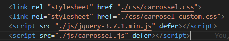

# Carrossel
Modelos de carrossel simples criado para utilizar em projetos, (é responsivo e personalizável)
Utilizando html, css, jquery

**Modelos:**

- [Carrossel Infinito](https://gustavoalbonico.github.io/carrossel/index.html)
    </br><a href="https://gustavoalbonico.github.io/carrossel/index.html"></a>
- [Carrossel Finito](https://gustavoalbonico.github.io/carrossel/index.html)
    </br><a href="https://gustavoalbonico.github.io/carrossel/index.html"></a>
- [Carrossel Finito de 4 itens mas tem 2](https://gustavoalbonico.github.io/carrossel/index.html)
    <a href="https://gustavoalbonico.github.io/carrossel/index.html"><p></p></a>
- [Carrosel Finito com css customizado](https://gustavoalbonico.github.io/carrossel/index.html)
    </br><a href="https://gustavoalbonico.github.io/carrossel/index.html"></a>
- [Carrossel Infinito Bloco](https://gustavoalbonico.github.io/carrossel/index.html)
    </br><a href="https://gustavoalbonico.github.io/carrossel/index.html"></a>
- [Carrossel Finito Bloco](https://gustavoalbonico.github.io/carrossel/index.html)
    </br><a href="https://gustavoalbonico.github.io/carrossel/index.html"></a>
- [Carrosseis Arrastáveis](https://gustavoalbonico.github.io/carrossel/index.html)
    </br><a href="https://gustavoalbonico.github.io/carrossel/index.html">
</a>

**Utilização:**

- Copiar os arquivos carrossel.css,  jquery-3.7.1.min.js ,carrossel.js e a estrutura do "carrossel-customizado-container"
    - EX import: <a href="https://gustavoalbonico.github.io/carrossel/index.html"><p></p></a>
- Para o carrossel ser infinito basta adicionar a classe "infinito" nos botões:
    - "carrossel-customizado-btn-proximo"
    - "carrossel-customizado-btn-anterior"
- Para o carrossel passar em bloco basta adicionar a classe "bloco" nos botões:
    - "carrossel-customizado-btn-proximo"
    - "carrossel-customizado-btn-anterior"
- Para o carrossel poder ser arrastavel adicionar a classe "arrastavel" nos botões:
    - "carrossel-customizado-btn-proximo"
    - "carrossel-customizado-btn-anterior"
    - OBS: Faz com que mobile se comporte do mesmo jeito | Se for utilizar a ou img utilize o atributo "draggabe='false'" nas tags
- O Carrossel Finito precisa ter a classe "carrossel-customizado-btn-disabled" no botão "carrossel-customizado-btn-anterior"
- Variaveis que vc pode utilizar no css para customizar:
    - --carrossel-height
    - --carrossel-itens-visiveis
    - --carrossel-itens-gap
    - --carrossel-animation-duration
    - --carrossel-botao-navegacao-tamanho

**Exemplos:**

```css
@media(min-width: 1025px) {
    #carrossel1.carrossel-customizado-container {
        --carrossel-itens-visiveis: 3;
    }

    #carrossel4.carrossel-customizado-container {
        --carrossel-itens-visiveis: 5;
    }

    #carrossel5.carrossel-customizado-container {
        --carrossel-itens-visiveis: 8;
    }

    #carrossel6.carrossel-customizado-container {
        --carrossel-itens-visiveis: 6;
    }
}

@media(max-width: 1024px) {
    #carrossel1.carrossel-customizado-container {
        --carrossel-itens-visiveis: 3;
    }
}

@media(max-width: 768px) {
    #carrossel1.carrossel-customizado-container {
        --carrossel-itens-visiveis: 2;
    }
}

@media(max-width: 425px) {
    #carrossel4.carrossel-customizado-container {
        --carrossel-height: 300px;
        --carrossel-itens-visiveis: 2;
    }
}
```

- Além disso possui exemplos no arquivo css "carrossel-custom.css".
